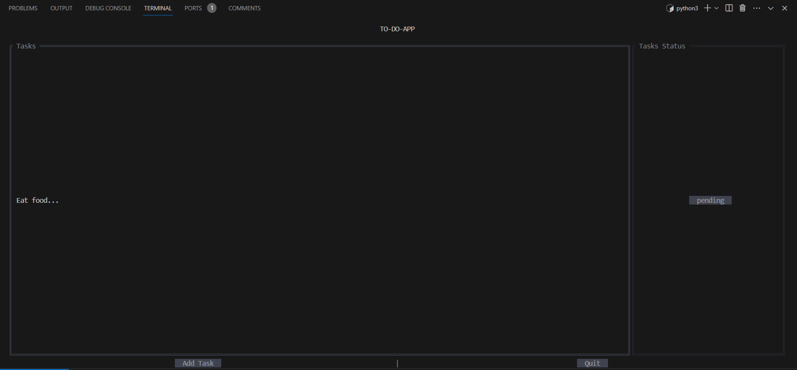
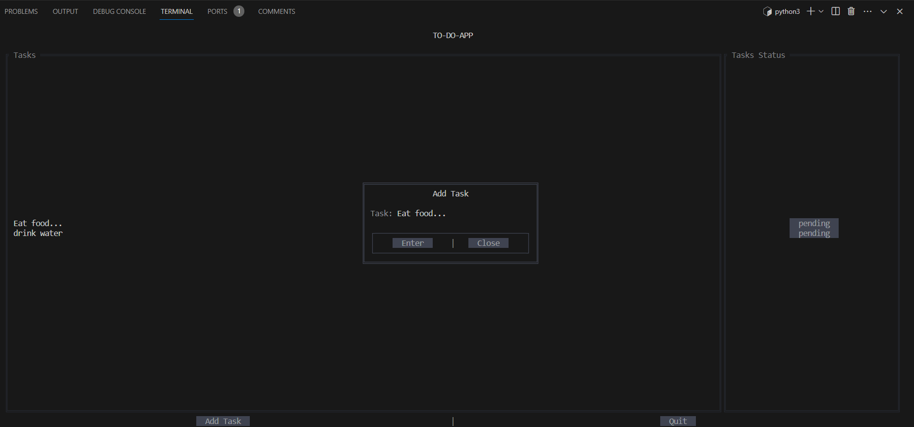
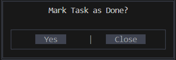

# To-Do App using PyTermGUI 

This To-Do App is built using PyTermGUI for the user interface. It allows users to manage their tasks through a simple command-line interface.

## Installation

1. Ensure you have Python 3 installed.
2. Install the required dependencies using pip:

    ```bash
    pip install pytermgui 
    ```

## Usage

Run the `to_do_app/main.py` file to start the To-Do App:

## ScreenShots

App


Add New Tasks


Mark Pending Task as done
